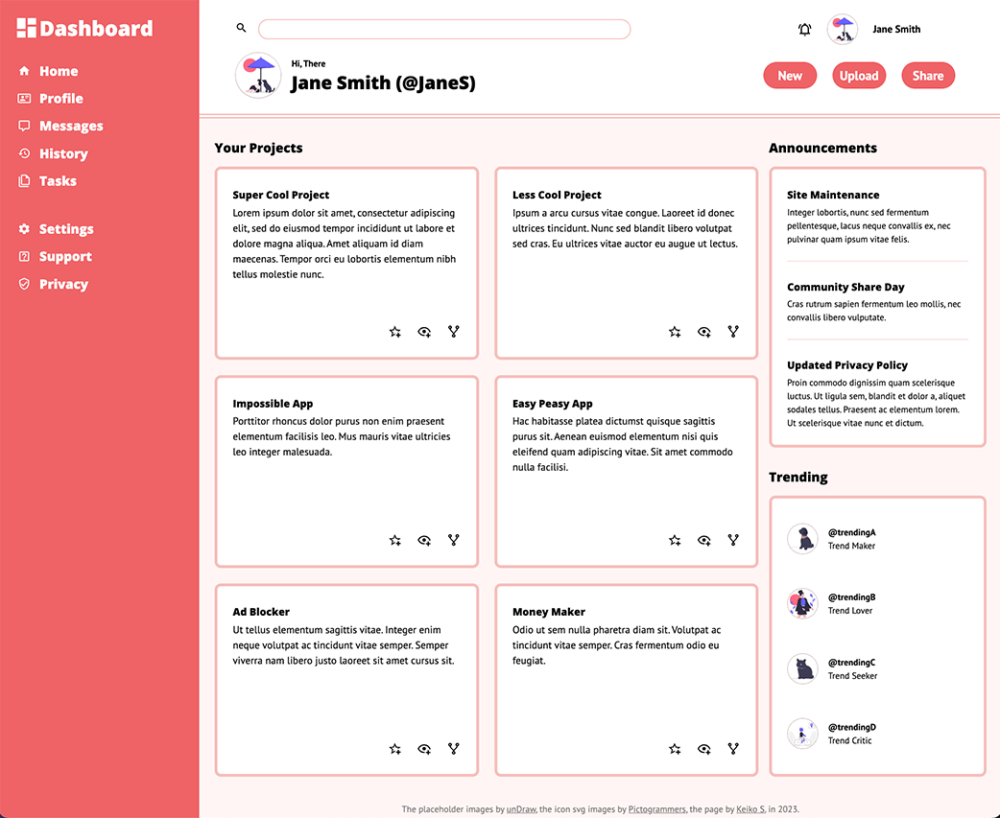
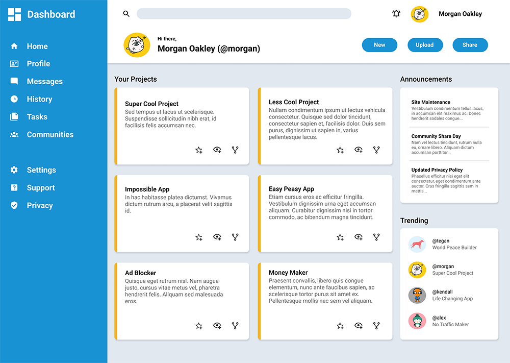

# odin-admin-dashboard
## Odin Project: Admin Dashboard

 
  

    
  

 

## Summary 

In this project, I utilized HTML and CSS to create an admin dashboard for <em> desktop browsers </em> to demonstrate my comprehension of Grid layout from previous lessons. The project details can be found [here](https://www.theodinproject.com/lessons/node-path-intermediate-html-and-css-admin-dashboard).

The following are key elements to take into account in order to complete the project:

#### Basic Requirements 

1. Use Grid as much as possible to create the full layout. 
2. Make the project cards section responsive to the browser window, if possible.
3. The final product can be styled using one's own design. 

Design Example

  
  
 
    
  

 

I utilized a variety of new skills while working on this project in addition to the ones I had learned in the previous projects as detailed in the following list:

　
  
 Problem Solving 

  - Recognize problems
  - Plan
  - Divide and conquer

　
  
 Error Correction 

  
- Use Chrome Developer Tools
- Web search for a solution

　
  
 Clean Code Writing 

  
- Use consistent indentation
- Use descriptive and consistent naming

　
  
 HTML 

- (New) Create a search bar 
- (New) Insert SVG codes inline
- (New) Use the 'aria-hidden="true"'

　
  
 CSS 

- (New) Use the 'position: sticky' property in Grid
- (New) Utilize the 'repeat(auto-fit, minmax())' function
- (New) Implement layouts with nested Grid 
- (New) Style the search bar
- (New) Apply color to SVG icons
- Apply a CSS reset
- Use custom fonts
- Use new properties for more detailed styling
- Use parent and sibling combinator
- Use pseudo selectors
- Use attribute selectors
- Use relative units mainly 
- Create and use custom properties

　
  
 Emmet 

- Use abbreviations on HTML writing
- Use shortcut keys

　
  
 SVG 

- Use SVG images

 

*** 

**Resources Used**
  - google-webfonts-helper by [Mario Ranftl](https://gwfh.mranftl.com/fonts)
  - HTML Color Names by [W3schools](https://www.w3schools.com/colors/colors_names.asp)
  - Can I use... by [BrowserStack](https://caniuse.com/)
  - Optimizilla by [SIA Webby](https://imagecompressor.com/)
  - Shade Generator by [shadegenerator.com](https://www.shadegenerator.com/)
  - ColorSpace by [mycolor.space](https://mycolor.space/)
  - Traditional Colors of Japan by [colordic.org](https://www.colordic.org/w)
  - unDraw by [Katerina Limpitsouni](https://undraw.co/)
  - Lorem Ipsum by [lipsum.com](https://www.lipsum.com/)
  - Lorem Ipsum Generator by [loremipsum.io](https://loremipsum.io/)
  

**List of Referenced Tutorials**

- ['Simplify your CSS with these 3 grid layout solutions' by Kevin Powell](https://youtu.be/JHregeIsjPQ)

- ['CSS Grid row/column gap on specific elements? [duplicate]' by stackoverflow](https://stackoverflow.com/questions/50531432/css-grid-row-column-gap-on-specific-elements)

- ['When position sticky doesn't stick' by Kevin Powell](https://youtube.com/shorts/39rbYbVhb0Y?feature=share)

- ['21 Google Fonts Combinations For Websites & Brands' by Garett Southerton](https://www.garett.co/21-google-fonts-combinations-for-websites-brands?utm_source=email&utm_medium=Social&utm_campaign=SocialWarfare)

- ['Serving Icons for your Web Apps: Tips and Tricks' by Roman Jaquez](https://medium.com/@romanejaquez/serving-icons-for-your-web-apps-tips-and-tricks-d8d62c0ebd2f)

- ['Headings' by W3C Web Accessibility Initiative (WAI)](https://www.w3.org/WAI/tutorials/page-structure/headings/#exception-for-fixed-page-sections)

- ['The Responsive Website Font Size Guidelines' by Erik D. Kennedy](https://www.learnui.design/blog/mobile-desktop-website-font-size-guidelines.html)

- ['How TO - Zoom on Hover' by W3Schools](https://www.w3schools.com/howto/howto_css_zoom_hover.asp)

- ['CSS top Property' by W3Schools](https://www.w3schools.com/cssref/pr_pos_top.php#:~:text=The%20top%20property%20affects%20the,of%20its%20nearest%20positioned%20ancestor)